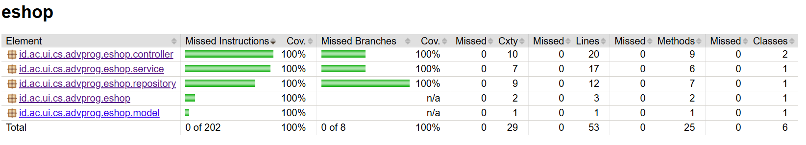

# Eshop Advance Programming

Name: Belva Ghani Abhinaya

Class: Advance Programming B

Student Number: 2306203526

Link to the eshop -> [Click This!](https://premier-willow-staphlerr-5a1cb0bd.koyeb.app/)

<details>
<summary><b>Reflection on Module 1</b></summary>
<br>

### Reflection 1 for Exercise 1
#### 1. Clean Code Principles

**a. Meaningful Names:**
- Class names (`ProductController`, `ProductService`, `ProductRepository`) and method names (`create`, `findAll`, `findById`, `update`, `deleteById`) are descriptive and follow domain-specific language.
- Variable names like `productData`, `productId`, and `allProduct` are clear and self-explanatory, making the code easier to understand without additional comments.

**b. Functions:**
- Each function is small, focused, and performs a single task:
    - `createProductPage` prepares the model for rendering the "create product" page.
    - `createProductPost` handles the creation of a new product.
    - `editProductPage` retrieves a product by ID and prepares it for editing.
    - `deleteProduct` to remove a product by ID.
    - This adherence to the Single Responsibility Principle ensures that functions are easy to test and maintain.

**c. Comments:**
- The code avoids unnecessary comments by using meaningful names and writing self-explanatory logic. For example:
    - Instead of commenting on what `product.setProductId(UUID.randomUUID().toString())` does, the code relies on the clarity of the method name and the context.
- However, where necessary (e.g., explaining why UUIDs are used), inline comments could be added for additional clarity.

**d. Objects and Data Structures:**
- The `Product` class is a simple data structure with private fields and public getters/setters (via Lombok annotations). This design keeps the model clean and focused on holding data.
- The `ProductRepository` encapsulates the data access logic, ensuring that the controller and service layers interact with data through well-defined methods.

**e. Error Handling:**
- The code uses exceptions to handle errors gracefully:
    - In `editProductPage`, if a product is not found, a `RuntimeException` is thrown.
    - While this works, custom exceptions (e.g., `ProductNotFoundException`) would improve clarity and allow centralized error handling.
- Adding logging (e.g., SLF4J) would further enhance error handling by providing traceability for issues.

---

#### 2. Secure Coding Practices

**a. Exception Handling:**
- The `editProductPage` and `update` methods handle missing products by throwing a `RuntimeException`. While this works, it’s better to use custom exceptions (e.g., `ProductNotFoundException`) for more meaningful error messages and centralized exception handling using `@ControllerAdvice`.

**b. UUID for Unique Identifiers:**
- The `ProductRepository` generates unique IDs using `UUID.randomUUID()`. This ensures that product IDs are globally unique and reduces the risk of ID collisions.

---

#### 3. Areas for Improvement

**a. Input Validation:**
- Add validation annotations (e.g., `@NotNull`, `@Size`, `@Min`) to the `Product` model fields to enforce constraints at the model level.

**b. Custom Exceptions:**
- Replace generic `RuntimeException` with custom exceptions for better error handling. For example:
  Update the `editProductPage` and `update` methods to throw `ProductNotFoundException` when a product is not found.

**c. Use Constants for Redirect URLs:**
- Replace hardcoded redirect strings with constants:
  ```java
  public class RedirectConstants {
      public static final String REDIRECT_LIST = "redirect:list";
  }
  ```
  Update the controller methods to use these constants:
  ```java
  return RedirectConstants.REDIRECT_LIST;
  ```

**d. Pagination for Large Datasets:**
- If the number of products grows significantly, consider implementing pagination in the `findAll` method to avoid performance issues.

---

#### 4. Conclusion

The code adheres to several clean code principles, such as meaningful names, focused functions, and proper object/data structure design. However, there are opportunities to improve error handling, input validation, and maintainability by introducing custom exceptions, centralized error handling, and constants for redirect URLs. By addressing these areas, the code can become more robust, secure, and maintainable.

This reflection highlights the importance of continuously evaluating and refining code to meet best practices and ensure long-term maintainability.

### Reflection 1 for Exercise 2

#### 1. Writing Unit Tests: Feelings and Insights
After writing the unit tests, I feel a sense of confidence in the correctness and reliability of the code. Writing unit tests forces me to think critically about edge cases, potential bugs, and the overall behavior of the application. It also helps me understand the codebase better by breaking down each method, as I try to focus on testing unique behaviors and edge cases rather than every possible input.

#### 2. How Many Unit Tests Should Be Made in a Class?
The number of unit tests in a class depends on the complexity and functionality of the class. Each test should focus on verifying one specific behavior or scenario. As a general rule, aim to cover all possible scenarios, including positive (happy path) and negative (edge cases) scenarios. For example:
- A `create` method might need tests for valid inputs, invalid inputs, duplicate IDs, etc.
- An `update` method / `delete` method might need tests for updating existing products, handling non-existent products, and validating updated fields.

#### 3. Ensuring Guarantee Bug-free/Error-free Unit Test Coverage
While achieving high code coverage (e.g., 80-90%) is a good indicator of thorough testing, **100% code coverage does not guarantee bug-free code**. Code coverage only measures whether the code was executed during testing, not whether the logic is correct. For example:
- A test might execute a line of code but fail to validate its output.
- Edge cases or complex interactions between components might still be untested.

---

#### 4. Functional Test Suite for Product List Count
Suppose I create a new functional test suite to verify the number of items in the product list. If I follow the same structure as `CreateProductFunctionalTest.java`, I would end up duplicating setup procedures and instance variables. This raises concerns about code cleanliness and maintainability.

##### Potential Clean Code Issues
1. **Code Duplication**:
  - Repeating the same setup procedures (e.g., navigating to the home page, clicking buttons) across multiple test classes violates the DRY (Don't Repeat Yourself) principle.
  - Duplicate code increases maintenance effort. If the application's navigation flow changes, I would need to update the setup in every test class.

2. **Reduced Readability**:
  - Copying large chunks of boilerplate code makes the new test suite harder to read and understand. The actual test logic gets buried under repetitive setup code.

3. **Tight Coupling**:
  - Hardcoding navigation steps (e.g., clicking "Let's Create Product!") ties the tests to the current UI structure. If the UI changes, the tests will break.

##### Reasons for These Issues
- Lack of abstraction: Common setup procedures and utility methods are not extracted into reusable components.
- Over-reliance on Selenium's direct element interactions without encapsulating them into helper methods.

##### Suggested Improvements
1. **Extract Common Setup into a Base Class**:
  - Create a base class that contains shared setup procedures and utility methods. All functional test classes can extend this base class.
  ```java
  public abstract class BaseFunctionalTest {
    @LocalServerPort
    protected int serverPort;
  
    @Value("${app.baseUrl:http://localhost}")
    protected String testBaseUrl;
  
    protected String baseUrl;
  
    @BeforeEach
    void setupTest() {
      baseUrl = String.format("%s:%d", testBaseUrl, serverPort);
    }
  
    protected void navigateToProductList(ChromeDriver driver) {
      driver.get(baseUrl);
      driver.findElement(By.linkText("Let's Create Product!")).click();
    }
}
  ```

2. **Use Page Object Model (POM)**:
  - Encapsulate UI interactions into separate classes (pages) to decouple test logic from UI details.

3. **Refactor the New Test Suite**:
  - Use the base class and page objects to simplify the new test suite. For example:
   ```java
   @SpringBootTest(webEnvironment = RANDOM_PORT)
   @ExtendWith(SeleniumJupiter.class)
   class ProductListCountFunctionalTest extends BaseFunctionalTest {

       @Test
       void testProductListCount(ChromeDriver driver) {
           HomePage homePage = new HomePage(driver);
           homePage.navigateToProductList();

           ProductListPage productListPage = new ProductListPage(driver);
           int initialCount = productListPage.getProductCount();

           // Add a product and verify the count increases
           // Simulate adding a product...

           int updatedCount = productListPage.getProductCount();
           assertEquals(initialCount + 1, updatedCount);
       }
   }
   ```

---

#### 5. Conclusion
Creating a new functional test suite highlights the importance of clean code principles like DRY, readability, and maintainability. Without proper abstraction and reuse, the new test suite risks introducing duplication and reducing code quality. By extracting common setup procedures into a base class and adopting the Page Object Model, we can make the code cleaner, more modular, and easier to maintain.

Additionally, while code coverage is a valuable metric, it should not be the sole measure of test quality. Thoughtful test design, edge case coverage, and manual review are essential to ensuring a robust and reliable tests.
</details>

<details>
<summary><b>Reflection on Module 2</b></summary>
<br>

### Reflection 2

#### 1. Code Quality Issues and Fixes
The primary code quality issue I addressed was the **unused import `org.springframework.web.bind.annotation.*`**. This was flagged by PMD, and I resolved it by replacing the wildcard import with specific imports for the annotations actually used in the code, such as `@GetMapping`, `@PostMapping`, and `@PathVariable`. Additionally, I ensured that all other imports were necessary and removed any redundancies to maintain clean and readable code. These changes improved the overall maintainability of the codebase and aligned with best practices for Java development.

---

#### 2. CI/CD Implementation and Evaluation
The implemented CI/CD workflows on GitHub Actions fully meet the definition of **Continuous Integration (CI)** and **Continuous Deployment (CD)**. The CI pipeline automatically runs tests, generates code coverage reports, and ensures code quality on every push or pull request, catching issues early in the development process. For CD, I successfully automated the deployment to **Koyeb** using a **Dockerfile** that packages the Spring Boot application into a lightweight Alpine-based image. The Dockerfile uses a multi-stage build to optimize the final image size, ensuring efficient deployment. With this setup, every merge to the main branch triggers an automated build and deployment process, making the workflow truly continuous.

---

#### 3. Code Coverage

</details>

<details open>
<summary><b>Reflection on Module 3</b></summary>
<br>

### Reflection 3

#### 1) What Principles Were Applied?

##### a) Single Responsibility Principle (SRP)
Each class now has a single responsibility:
- **`CarController`**: Handles HTTP requests and delegates business logic to `CarService`. For example:
  ```java
  @PostMapping("/createCar")
  public String createCarPost(@ModelAttribute("car") Car car) {
      carService.create(car); // Delegates creation logic to CarService
      return "redirect:listCar";
  }
  ```
  The controller does not handle data storage directly; it relies on `CarService`.

- **`CarRepository`**: Manages data storage and retrieval. For example:
  ```java
  public Car findById(String id) {
      for (Car car : carData) {
          if (car.getCarId().equals(id)) {
              return car;
          }
      }
      return null;
  }
  ```
  This method focuses solely on finding a car by its ID.

##### b) Open/Closed Principle (OCP)
The code is open for extension but closed for modification:
- In `ProductRepository`, adding a new query (e.g., filtering products by name) can be done without modifying existing methods:
  ```java
  public Optional<Product> findByName(String name) {
      return productData.stream()
              .filter(product -> product.getProductName().equals(name))
              .findFirst();
  }
  ```
  Existing methods like `findById` remain untouched.

##### c) Liskov Substitution Principle (LSP)
All implementations of interfaces adhere to their contracts:
- For example, `CarServiceImpl` implements all methods defined in `CarService`:
  ```java
  @Override
  public Car findById(String carId) {
      return carRepository.findById(carId);
  }
  ```
  This ensures that `CarServiceImpl` can replace `CarService` without breaking functionality.

##### d) Interface Segregation Principle (ISP)
Interfaces are specific to their responsibilities:
- `CarService` and `ProductService` are separate interfaces, avoiding unnecessary dependencies:
  ```java
  public interface CarService {
      Car create(Car car);
      List<Car> findAll();
      Car findById(String carId);
      void update(String carId, Car car);
      void deleteCarById(String id);
  }
  ```
  `CarService` does not include methods irrelevant to cars, such as `filterByCategory`.

##### e) Dependency Inversion Principle (DIP)
High-level modules depend on abstractions rather than concrete implementations:
- For example, `CarController` depends on `CarService` (an interface), not `CarServiceImpl`:
  ```java
  private final CarService carService;

  @Autowired
  public CarController(CarService carService) {
      this.carService = carService;
  }
  ```
  This allows flexibility in swapping implementations (e.g., mocking `CarService` in tests).

---

#### 2) Advantages of Applying SOLID Principles

##### a) Improved Maintainability
- **Example**: If we need to change how cars are stored, we only modify `CarRepository` without affecting `CarController`:
  ```java
  public Car findById(String id) {
      // Logic for finding a car by ID
  }
  ```
  The controller remains unchanged because it delegates storage logic to the repository.

##### b) Enhanced Flexibility
- **Example**: Adding a new feature (e.g., filtering cars by color) does not require modifying existing methods:
  ```java
  public List<Car> findByColor(String color) {
      return carData.stream()
              .filter(car -> car.getCarColor().equals(color))
              .toList();
  }
  ```
  Existing methods like `findAll` remain unaffected.

##### c) Better Testability
- **Example**: With DIP, we can mock `CarService` in unit tests for `CarController`:
  ```java
  @Mock
  private CarService carService;

  @Test
  public void testCreateCar() {
      Car car = new Car();
      when(carService.create(car)).thenReturn(car);
      // Test logic here
  }
  ```

##### d) Reduced Code Duplication
- **Example**: Separating `CarService` and `ProductService` avoids redundant methods:
  ```java
  public interface CarService {
      Car create(Car car);
  }

  public interface ProductService {
      Product create(Product product);
  }
  ```
  Each interface serves a specific purpose.

---

#### 3) Disadvantages of Not Applying SOLID Principles

##### a) Tight Coupling
- **Example**: Without DIP, `CarController` would depend directly on `CarServiceImpl`:
  ```java
  private final CarServiceImpl carService = new CarServiceImpl();
  ```
  Switching to a different implementation (e.g., a caching service) would require modifying the controller.

##### b) Code Bloat
- **Example**: Violating SRP leads to bloated classes:
  ```java
  public class CarController {
      public String createCarPost(Car car) {
          // Handle routing
          // Handle business logic
          // Handle data storage
      }
  }
  ```
  This makes the class harder to read and maintain.

##### c) Fragile Code
- **Example**: Without OCP, adding a new feature (e.g., filtering cars by color) would require modifying existing methods:
  ```java
  public List<Car> findAll() {
      // Original logic
      // Add filtering logic here
  }
  ```
  This increases the risk of introducing bugs.

##### d) Poor Scalability
- **Example**: Violating ISP results in interfaces with unnecessary methods:
  ```java
  public interface CarService {
      Car create(Car car);
      List<Car> findAll();
      Car filterByCategory(String category); // Irrelevant for cars
  }
  ```
  This confuses developers and complicates maintenance.

---

#### Conclusion

By applying SOLID principles, the project achieves:
- **Maintainability**: Easier to update and debug.
- **Flexibility**: Extensible without breaking existing code.
- **Testability**: Simplifies unit testing with dependency injection.
- **Scalability**: Supports future growth without excessive refactoring.

These principles ensure that the codebase remains robust, clean, and adaptable to changing requirements.
</details>